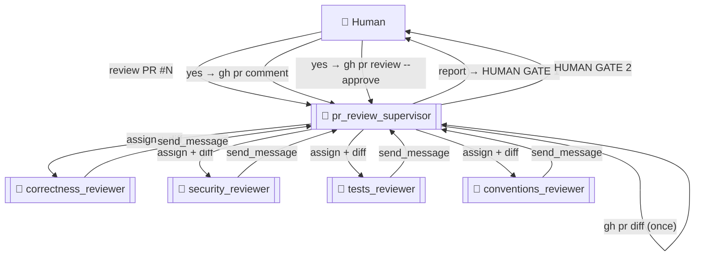

# PR Review Team

A CAO multi-agent team that reviews a pull request on the CAO repo from four angles in
parallel, synthesizes one report, and drives it to a **human-gated** comment + approval.

This is the team companion to the `cao-pr-review` skill: the four reviewers each load that
skill and apply one slice of its checklist.

There are **two ways to use it**:

1. **Direct, one PR** — launch `pr_review_supervisor`, ask it to review a PR; it runs the
   four-angle review and gates with two in-terminal `yes/no` prompts (comment, then approve).
2. **Managed queue + dashboard** — launch `pr_review_manager`; it discovers open PRs,
   reviews the new/changed ones (handing each to the supervisor in *dashboard mode*, which
   writes a report file instead of gating), and you act on all of them from a web dashboard
   (`dashboard/server.py`) with live Approve / Comment / Request-changes buttons.

The rest of this README covers the direct team. See **Managed queue + dashboard** below for
the meta-agent flow.

## Topology



| Agent | Role | Angle |
|---|---|---|
| `pr_review_supervisor` | supervisor | Fetch diff, fan out, synthesize, comment, approve (gated) |
| `correctness_reviewer` | reviewer | Logic, edge cases, async/races, provider status detection |
| `security_reviewer` | reviewer | Credentials, tmux/subprocess injection, `--yolo` surface, traversal |
| `tests_reviewer` | reviewer | Tests present? markers, mocked `tmux_client`, coverage gaps |
| `conventions_reviewer` | reviewer | Inclusive language, CHANGELOG, `pyproject↔uv.lock`, provider checklist, CI gates |

## Pipeline

1. Supervisor fetches the PR diff **once** (`gh pr diff`).
2. Assigns the diff to all four reviewers in parallel (`assign`); each reviews its angle.
3. Reviewers send findings back (`send_message`); supervisor merges into one
   severity-grouped report, classifying findings as introduced vs. pre-existing.
4. **Human gate 1** — supervisor presents the report and asks before posting it as a PR
   comment (`gh pr comment`).
5. **Human gate 2** — after the comment, asks before approving (`gh pr review --approve`).

Two separate confirmations; the supervisor never posts or approves on its own. It never
merges.

## Setup

Requires the `gh` CLI authenticated with `repo` scope (for comment + approve), the
`cao-server` running, and the `cao-pr-review` skill installed.

```bash
# 1. Start the server (if not already running)
cao-server

# 2. Install the skill the reviewers depend on (folder name must equal the skill name)
cao skills add skills/cao-pr-review

# 3. Install the five agent profiles
cao install examples/pr-review/pr_review_supervisor.md
cao install examples/pr-review/correctness_reviewer.md
cao install examples/pr-review/security_reviewer.md
cao install examples/pr-review/tests_reviewer.md
cao install examples/pr-review/conventions_reviewer.md

# 4. Launch the supervisor (claude_code — where the skill lives)
cao launch --agents pr_review_supervisor --provider claude_code
```

> The reviewers inherit the supervisor's provider (`claude_code`) since their profiles
> declare no `provider` key.

## Usage

In the supervisor terminal:

```
Review PR #309.
```

or with an explicit repo / URL:

```
Review https://github.com/awslabs/cli-agent-orchestrator/pull/309
```

The supervisor fans out, collects the four angles, and presents the merged report — then
pauses for your go-ahead on the comment, and again on the approval.

## Managed queue + dashboard

For reviewing many PRs and acting on them from a browser, add two more pieces:

- **`pr_review_manager`** — a meta-agent that discovers open PRs (`gh pr list`), tracks the
  head commit it last reviewed each at (`pr-review-data/state.json`), and hands off only
  **new or changed** PRs to the supervisor in *dashboard mode*. Re-reviews a PR automatically
  when the author pushes new commits (the head SHA changes). Never posts to GitHub itself.
- **`dashboard/server.py`** — a small local FastAPI app that renders every review report and
  exposes live **Approve / Comment / Request-changes** buttons. It is the human gate for the
  managed flow.

### How it fits together

```
pr_review_manager                       ← you launch on demand
  gh pr list → open PRs
  compare each head SHA to state.json
  new/changed → handoff → pr_review_supervisor (dashboard mode)
                            └─ 4 reviewers (assign) → report
  writes  pr-review-data/reviews/<pr>-<sha>.md  +  state.json
        ↓
dashboard/server.py (localhost)         ← you keep open in a browser
  renders each review · [Approve] [Comment] [Request changes]
  button → runs gh immediately → shows result
```

### Setup (managed flow)

```bash
# 1. server + skill + profiles (as above), plus the manager:
cao install examples/pr-review/pr_review_manager.md

# 2. launch the manager (reviews all open PRs that are new/changed)
cao launch --agents pr_review_manager --provider claude_code --yolo
#   in its terminal:  Review all open PRs.

# 3. open the dashboard — START IN DRY-RUN (default): buttons only PRINT the gh command
uv run --no-project --with fastapi --with uvicorn --with markdown \
    examples/pr-review/dashboard/server.py
#   → http://localhost:8787   (reads ./pr-review-data, repo-root)

# 4. when you trust it, run for real:
uv run --no-project --with fastapi --with uvicorn --with markdown \
    examples/pr-review/dashboard/server.py --execute
```

> **`--no-project` is required** — it isolates the dashboard's deps from CAO's, which avoids
> trying to build numpy (a transitive dep) from source.
>
> **Data path:** the manager writes to `pr-review-data/` at the repo root (its working
> directory), and the dashboard defaults to the same path. Run the dashboard from the repo
> root, or pass `--data-dir /abs/path/to/repo/pr-review-data`. This directory is gitignored.
>
> **Re-review:** the dashboard shows a **"stale"** badge on any PR whose head SHA changed
> after you acted on it — your cue that the author pushed fixes and it was re-reviewed.

`dashboard/sample/sample-review.md` is a real report this system produced (PR #325), kept as
a format reference.

## Notes

- **Why a team, not the skill alone?** The skill gives one agent the full checklist; the
  team runs the four angles as independent reviewers in parallel, so each gives the diff its
  full attention and they can't crowd each other out. The supervisor's job is fetch +
  synthesize + gate.
- **Diff is fetched once** by the supervisor and passed in messages — reviewers stay off
  GitHub, which keeps them simple and avoids four redundant `gh` calls.
- **Message delivery**: the supervisor finishes its turn after dispatching so the inbox can
  deliver findings — it must not `sleep`/`echo`-loop to wait (see the supervisor profile).
- **MCP server**: the profiles use `command: cao-mcp-server` (the locally-installed binary).
  Don't point it at `uvx --from git+...` — that rebuilds numpy from source and the MCP tools
  silently fail to load, making the supervisor fall back to non-CAO behavior.
- Scope: the team reviews and (with approval) comments + approves. It does **not** merge.
